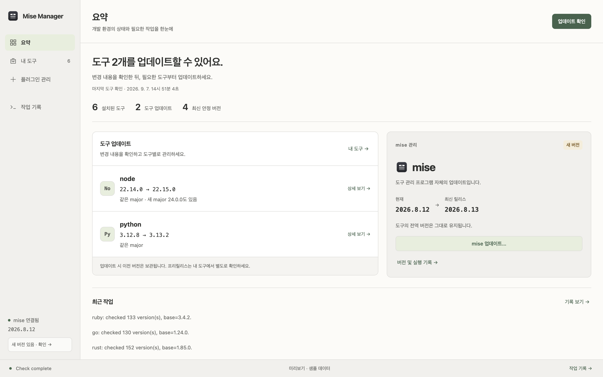

# Mise Manager

[English](./README.md) | **한국어**

[mise](https://mise.jdx.dev/)로 설치한 런타임, 도구, 플러그인을 조회하고 관리하는 macOS 네이티브 앱입니다.

앱에서 설치된 버전을 관리하고, 메뉴바에서 업데이트를 확인하거나 전역 버전을 전환할 수 있습니다. 설치된 major 계열을 각각 추적하므로 Node 26과 Node 24를 함께 사용해도 각 계열의 최신 버전으로 업데이트할 수 있습니다. `mise` CLI를 대신 실행하며 명령의 실시간 출력도 앱 안에서 보여 줍니다.

## 지원 플랫폼

- macOS 14 (Sonoma) 이상, Apple silicon과 Intel.

0.2.0부터 Tauri/Svelte 앱을 SwiftUI + AppKit으로 교체했습니다. 마지막 Tauri 빌드는 `v0.1.2-tauri` 태그에 있습니다.

## 스크린샷

[](./docs/images/mise-manager-overview.png)

**앱 창:** 도구를 찾고, 설치된 각 major 계열의 업데이트를 확인하고, 전역 버전을 관리합니다. **메뉴바:** 빨간 배지와 개수로 mise·도구·플러그인의 업데이트 여부를 알려 줍니다. 작은 창을 열어 업데이트를 확인하고 새 버전을 설치하거나 사용할 버전을 전환합니다.

원본 크기로 보기: [앱 창](./docs/images/mise-manager-app.png) · [메뉴바 아이콘과 화면](./docs/images/mise-manager-menu-bar.png)

스크린샷은 0.1.x 웹 UI를 샘플 데이터로 찍은 것이며, 네이티브 앱도 같은 구성과 문구를 씁니다.

## 주요 기능

- 검색 가능한 사이드바에서 설치된 도구를 바로 선택합니다. 상세 화면에서 설치된 각 major 계열과 최신 안정 버전을 확인하고 전역 버전을 선택합니다.
- 사이드바에서 **mise**, **플러그인 관리**, **작업 기록**, **설정**을 엽니다.
- **업데이트**에서 도구의 각 버전 계열, mise, 외부 플러그인의 업데이트를 한 목록으로 확인합니다. 사이드바 배지와 macOS 메뉴바에 같은 업데이트 수가 표시됩니다. 업데이트가 있으면 메뉴바 아이콘에 빨간 점이 붙고, 남은 업데이트가 없으면 사라집니다. 확인하지 못했거나 확인에 실패한 항목도 별도로 보여 줍니다.
- 메뉴바 아이콘을 누르면 작은 창에서 도구 목록을 확인하고, 계열별 업데이트를 설치하거나 전역 버전을 선택할 수 있습니다. 창은 어느 디스플레이에서 눌러도 그 아이콘 아래에 열리고, 앱을 활성화하지 않으며, 바깥을 클릭하거나 Esc를 누르면 닫힙니다. **설정 → 메뉴바 아이콘 표시**는 기본으로 켜져 있으며 앱을 다시 실행해도 선택을 유지합니다. mise 자체 업데이트와 새 major 설치는 앱 창에서 검토합니다. 앱 창을 닫아도 앱은 계속 실행되며, Dock에서 다시 열고 앱 메뉴나 메뉴바 창에서 종료합니다.
- 설치된 major 계열을 각각 추적합니다. 도구마다 원격 버전 목록을 한 번 조회해 Node 26과 Node 24의 최신 안정 버전을 따로 찾습니다.
- 도구 버전을 설치하고 전역 버전을 전환하거나 사용하지 않는 버전을 삭제합니다.
- 계열별 업데이트는 기존 설치 버전과 전역 기본값을 유지합니다. 설정에서 현재 전역 버전과 같은 major를 업데이트할 때 기본값도 전환하도록 선택할 수 있으며, 다른 major의 업데이트는 전역 기본값을 바꾸지 않습니다.
- 원격 플러그인 정의를 검색하고 custom Git URL을 포함한 사용자 플러그인을 설치·수정·제거합니다.
- mise의 플러그인 업데이트 명령으로 외부 플러그인 소스의 업데이트를 확인하고 적용합니다. Core plugin은 mise에 포함되며, 링크나 압축 파일로 설치한 플러그인은 Git 업데이트를 지원하지 않을 수 있습니다. 지원하지 않는 확인 방식이나 원격 조회 실패는 오류로 표시합니다.
- mise 자체를 업데이트하고 실시간 stdout/stderr와 작업 로그를 확인합니다.
- **설정**에서 앱을 열 때 업데이트 확인(기본 켜짐), 실행 중 1·6·24시간마다 확인(기본 꺼짐), 시스템·라이트·다크 테마, 프리릴리스 후보 표시를 선택합니다. 설정은 이 기기에 저장되며 업데이트를 자동으로 설치하지는 않습니다.

## 안전장치

- 전역 설정에 등록된 버전은 삭제할 수 없으며, 전역 설정을 읽지 못한 경우에도 삭제를 차단합니다.
- Core plugin은 앱에서 제거할 수 없습니다.
- 도구 버전 삭제, mise 자체 업데이트, major 버전 업데이트에는 확인 단계가 있습니다.
- 원클릭 업데이트 후에도 이전에 설치된 버전을 유지합니다.
- `~/.config/mise/config.toml`은 `[tool_alias]` 섹션만 고치고 나머지 줄·주석·순서는 그대로 둡니다. TOML로 보이지 않는 파일은 건드리지 않습니다.

## 요구사항

앱 사용:

- [mise](https://mise.jdx.dev/getting-started.html), 또는 mise를 찾지 못했을 때 표시되는 앱 내 설치 안내
- 릴리즈 확인과 원격 플러그인 정보를 위한 네트워크 연결

소스 빌드:

- Xcode 16 이상 (Swift 6)
- `project.yml`을 고칠 때만 [XcodeGen](https://github.com/yonaskolb/XcodeGen) (생성된 `MiseManager.xcodeproj`는 추적됨)

## 시작하기

```bash
git clone https://github.com/mabyko/mise-manager.git
cd mise-manager
open MiseManager.xcodeproj
```

`MiseManager` 스킴을 실행합니다. Debug 구성은 **Mise Manager Dev**라는 이름과 별도 아이콘·설정 도메인으로 릴리스 빌드와 나란히 설치됩니다.

## 빌드

```bash
scripts/release.sh
```

Release 구성을 빌드해 `build/release/MiseManager-<version>.dmg`를 만듭니다. 서명은 `Config/Local.xcconfig`를 따르며(아래 참고), 파일이 없으면 로컬 실행용 ad-hoc 서명입니다. Developer ID 서명과 공증은 아직 연결하지 않았습니다.

## 테스트

```bash
scripts/test.sh
```

`MiseCore`(UI 없는 Swift 패키지)에 mise 연동, 파서, 업데이트 규칙, 앱 상태와 그 테스트가 있고, 앱 테스트 번들은 메뉴바 위치 계산을 검사합니다. 일부 테스트는 mise가 설치돼 있으면 실제 mise로 실행됩니다.

## 동작 방식

Mise Manager는 설치된 `mise` 실행 파일에 런타임과 플러그인 관리 작업을 위임합니다.

| 작업 | 명령 |
| --- | --- |
| mise 버전 확인 | `mise --version` |
| 설치·전역 도구 버전 조회 | `mise ls --installed --json`, `mise ls --global --json` |
| 사용 가능한 버전 확인 | `mise ls-remote <tool> --json` |
| 도구 버전 설치 | `mise install -y <tool>@<version>` |
| 전역 버전 선택 | `mise use -g -y <tool>@<version>` |
| 도구 버전 제거 | `mise uninstall -y <tool>@<version>` |
| 플러그인 정의 관리 | `mise plugins install`, `mise plugins uninstall` |
| 플러그인 소스 업데이트 확인 | `mise plugins ls --user --outdated` |
| 플러그인 하나의 소스 업데이트 | `mise plugins update <plugin>` |
| mise 업데이트 | `mise self-update -y --no-plugins` |

GUI 앱은 셸 `PATH` 없이 시작하므로 mise는 `MISE_BIN`과 일반적인 설치 경로(`~/.local/bin`, `~/.mise/bin`, Homebrew, `/usr/local/bin`)에서 찾습니다. 관찰 가능한 `AppState` 하나가 앱 창과 메뉴바 창을 함께 움직이고, 메뉴바 창에서 요청한 작업은 현재 상태에 맞는지 확인한 뒤 실행합니다.

플러그인을 업데이트하면 저장된 도구 버전 후보를 비웁니다. 전체 업데이트 확인을 다시 실행하면 최신 후보를 가져옵니다. 오래된 mise는 `--outdated`를 지원하지 않을 수 있습니다. 패키지 관리자로 설치해 자체 업데이트가 비활성화된 mise는 해당 패키지 관리자로 업데이트해야 합니다. 현재 버전 추적은 major 단위이므로 Python 3.11과 3.12는 같은 `3.x` 계열로 묶입니다. 임의의 minor 계열 추적과 프로젝트별 버전 고정은 지원하지 않습니다.

## 프로젝트 구조

| 경로 | 역할 |
| --- | --- |
| `Packages/MiseCore/` | Swift 패키지: mise CLI 실행, 파서, 버전·업데이트 규칙, `config.toml` 편집, 앱 상태와 기능 흐름, 테스트 |
| `MiseManager/App/` | 앱 진입점, delegate, 디버그 훅 |
| `MiseManager/Views/` | SwiftUI 메인 창(사이드바, 탭, 다이얼로그, 상태바)과 메뉴바 창 |
| `MiseManager/MenuBar/` | `NSStatusItem`, 배지, 비활성화 `NSPanel`, 위치 계산 |
| `MiseManager/Resources/` | Asset catalog (`AppIcon`, `AppIcon-Dev`, 브랜드 아이콘) |
| `Config/` | `Base.xcconfig`(추적)와 `Local.xcconfig`(무시) |
| `project.yml` | `MiseManager.xcodeproj`를 만드는 XcodeGen 스펙 |
| `assets/icon.iconset/` | 1024px 앱 아이콘 마스터 |

## Bundle ID 안전장치

추적되는 설정은 의도적으로 희생용 ID인 `forked.misemanager.local`을 쓰고 서명 팀을 두지 않습니다. 조직 또는 개인 서명 ID를 커밋하지 마세요.

개인 빌드가 필요하면 git에서 제외된 `Config/Local.xcconfig`를 만듭니다.

```xcconfig
MISEMANAGER_BUNDLE_ID = <personal-bundle-id>
MISEMANAGER_BUNDLE_ID[config=Debug] = <personal-bundle-id>.dev
DEVELOPMENT_TEAM = <인증서 OU의 팀 ID>
```

파일이 있으면 `Base.xcconfig`가 자동으로 포함합니다.

## 기여하기

Issue와 pull request를 환영합니다. 변경 범위를 작게 유지하고, 동작이 바뀌면 테스트를 추가하고, 제출 전에 `scripts/test.sh`를 실행해 주세요.

주요 변경 내역은 [CHANGELOG.md](./CHANGELOG.md)에서 확인할 수 있습니다.

## 라이선스

Mise Manager는 [MIT 라이선스](./LICENSE)로 배포됩니다.
