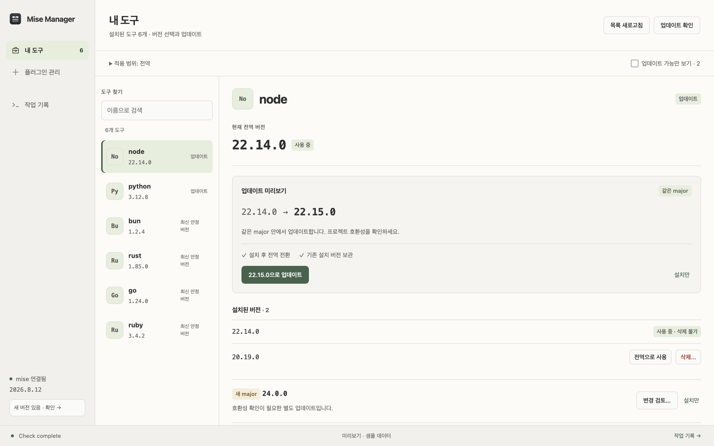
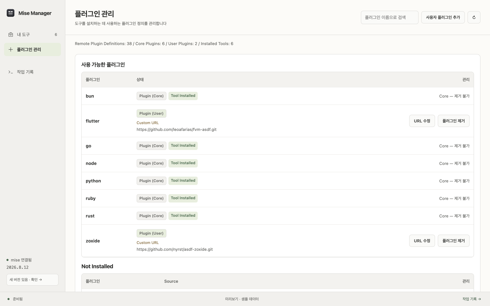
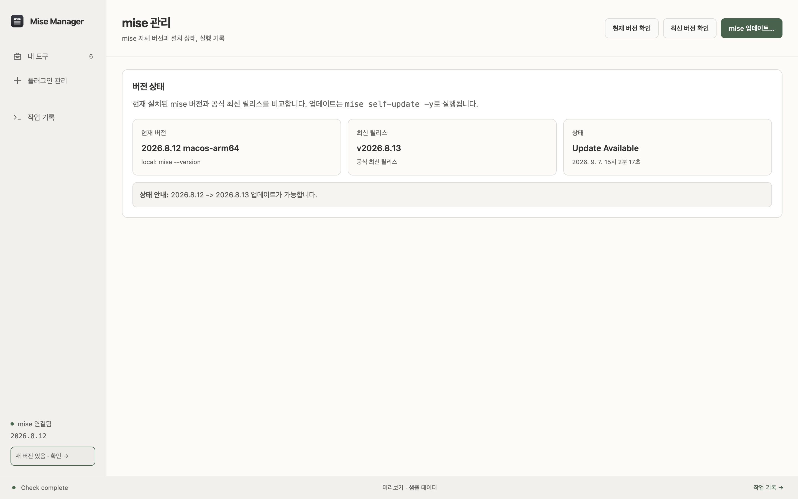

# Mise Manager

**English** | [한국어](./README.ko.md)

A desktop GUI for browsing and managing runtimes, tools, and plugins with [mise](https://mise.jdx.dev/).

Mise Manager is a focused interface over the `mise` CLI. It shows installed versions and global selections, checks for updates, and runs common management actions without requiring you to memorize every command. Live command output stays visible in the app.

## Platform Support

- [x] macOS — supported and verified
- [ ] Windows (Alpha) — build and runtime behavior need verification

macOS is currently the only supported platform.

## Screenshots

Captured from the actual app UI in browser preview with the light theme. Tool names and versions use sample data. Click a screenshot to view the full-size image.

| My Tools | Plugins | mise Management |
| :---: | :---: | :---: |
| <a href="./docs/images/mise-manager-my-tools.png"></a> | <a href="./docs/images/mise-manager-plugin-installs.png"></a> | <a href="./docs/images/mise-manager-mise.png"></a> |

## Features

- Start in **My Tools** to search or filter for updates, then review the current global version and proposed changes in the detail pane beside the list.
- Open **mise Management** from the sidebar footer to check or update mise itself, and use **Logs** for recent activity.
- Compare same-major, latest stable, and pre-release candidates for every installed tool.
- Install tool versions, switch the global version, or remove unused versions.
- Update a tool in one action while keeping the previous version available for rollback.
- Browse remote plugin definitions and install, edit, or remove user plugins, including custom Git URLs.
- Update mise itself and view live stdout/stderr and operation logs.
- Use a responsive interface with light and dark color schemes.

## Safety

- The active global version cannot be removed.
- Core plugins cannot be removed from the app.
- Tool deletion, mise self-update, and major-version updates require confirmation.
- One-click updates keep the previously installed version.

## Requirements

To use the app:

- [mise](https://mise.jdx.dev/getting-started.html), or the in-app installation guidance when mise is not detected
- Network access for release checks and remote plugin data

To build from source:

- [Bun](https://bun.sh/)
- Rust 1.77.2 or newer
- The [Tauri system prerequisites](https://v2.tauri.app/start/prerequisites/) for your platform

## Getting Started

```bash
git clone https://github.com/mabyko/mise-manager.git
cd mise-manager
bun install
bun run dev
```

To work on the frontend without launching Tauri, run the browser UI with its mock backend:

```bash
bun run ui:dev
```

## Build

```bash
bun run build
```

On macOS, build only the application bundle with:

```bash
bun run build -- --bundles app
```

Build artifacts are written under `src-tauri/target/release/bundle/`.

## Test

```bash
bunx vitest run
bun run ui:build

cd src-tauri
cargo test
cargo check
```

## How It Works

Mise Manager delegates runtime and plugin management to the installed `mise` executable:

| Action | Command |
| --- | --- |
| Read the mise version | `mise --version` |
| List installed and global tool versions | `mise ls --installed --json`, `mise ls --global --json` |
| Check available versions | `mise ls-remote <tool> --json` |
| Install a tool version | `mise install -y <tool>@<version>` |
| Select a global version | `mise use -g -y <tool>@<version>` |
| Remove a tool version | `mise uninstall -y <tool>@<version>` |
| Manage plugin definitions | `mise plugins install`, `mise plugins uninstall` |
| Update mise | `mise self-update -y` |

## Project Structure

| Path | Purpose |
| --- | --- |
| `src/mainview/` | Svelte 5 frontend |
| `src/shared/` | Frontend/backend contracts and shared version logic |
| `src-tauri/src/` | Rust commands, mise process integration, and configuration editing |
| `src-tauri/tauri.conf.json` | Tauri application and bundle configuration |

## Bundle Identifier Safety

The tracked Tauri configuration intentionally uses the sacrificial identifier `forked.misemanager.local`. Do not commit an organization or personal signing identifier.

For a personal build, create the ignored file `src-tauri/tauri.local.conf.json`:

```json
{
  "identifier": "<personal-bundle-id>"
}
```

Apply it explicitly:

```bash
bun run dev -- --config src-tauri/tauri.local.conf.json
bun run build -- --config src-tauri/tauri.local.conf.json
```

## Contributing

Issues and pull requests are welcome. Keep changes focused, add tests for behavior changes, and run the frontend and Rust checks above before submitting.

See [CHANGELOG.md](./CHANGELOG.md) for notable changes.

## License

Mise Manager is available under the [MIT License](./LICENSE).
